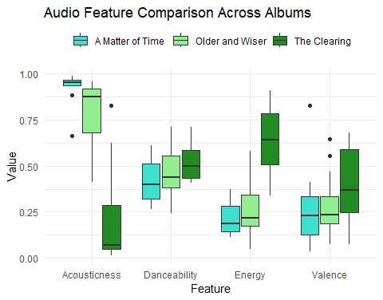
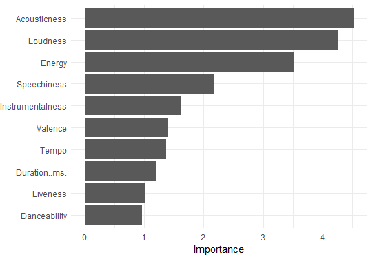

# Computational Musicology- Corpus

In the past year, I have been to 3 concerts. I choose to go to concerts of only those artists whose sound I like a lot. This is a comparison of the 3 artists whose concert I saw, and the albums they toured with. 

* The 3 artists and albums are: 
  + 1) Wolf Alice- The Clearing
  + 2) Laufey- A Matter of Time
  + 3) Lizzy Mcalpine- Older (and Wiser)


* The 3 songs I have chosen to represent each of the albums are respectively:
  + 1) White Horses
  + 2) Carousel
  + 3) Broken Glass

I chose the songs which I enjoyed listening to the most in the concert. 

With this corpus, my purpose is to investigate how similar or different my tastes are in regards to who I want to see in concert. I want to identify whether there are common features which may draw me to these albums.

# Chromagrams

### Row

WIP

### Row

WIP

### Row

WIP

# Keygram

WIP

### Row

WIP

# Tempogram

### Row

WIP

### Row

WIP

### Row

WIP

# Classfication 

## Column {width=40%}

Based on the albums, I expect 'A Matter of Time' and 'Older (and Wiser)' to be harder to tell apart, this can also be seen in the box plot on the right. They are both more acoustic, similar in energy and in other features as well. In contrast, 'The Clearing' is more different than the other albums. 

```{r}
library(tidymodels)
library(compmus)

library(tidymodels)

matter <- read.csv("C:/Users/sargu/Downloads/CM actual/amot.csv")
clearing <- read.csv("C:/Users/sargu/Downloads/CM actual/the_clearing.csv")
older <- read.csv("C:/Users/sargu/Downloads/CM actual/older_and_wiser.csv")

albums <-
  bind_rows(
    matter |> mutate(Category = "A Matter of Time"),
    clearing |> mutate(Category = "The Clearing"),
    older |> mutate(Category = "Older and Wiser")
  ) 

get_conf_mat <- function(fit) {
  outcome <- .get_tune_outcome_names(fit)
  fit |> 
    collect_predictions() |> 
    conf_mat(truth = outcome, estimate = .pred_class)
}  

get_pr <- function(fit) {
  fit |> 
    conf_mat_resampled() |> 
    group_by(Prediction) |> mutate(precision = Freq / sum(Freq)) |> 
    group_by(Truth) |> mutate(recall = Freq / sum(Freq)) |> 
    ungroup() |> filter(Prediction == Truth) |> 
    select(class = Prediction, precision, recall)
}  

albums_recipe <-
  recipe(
    Album.Name ~
      Danceability +
      Energy +
      Loudness +
      Speechiness +
      Acousticness +
      Instrumentalness +
      Liveness +
      Valence +
      Tempo +
      `Duration..ms.`,
    data = albums                    # Use the same name as the previous block.
  ) |>
  step_center(all_predictors()) |>
  step_scale(all_predictors())      # Converts to z-scores.
# step_range(all_predictors())    # Sets range to [0, 1].

albums_cv <- albums |> vfold_cv(10)

forest_model <-
  rand_forest() |>
  set_mode("classification") |> 
  set_engine("ranger", importance = "impurity")

albums_forest <- 
  workflow() |> 
  add_recipe(albums_recipe) |> 
  add_model(forest_model) |> 
  fit_resamples(
    albums_cv, 
    control = control_resamples(save_pred = TRUE)
  )

albums_forest |> get_pr()

albums_forest |> get_conf_mat() |> autoplot(type = "heatmap")
```
From these numbers, we can see that indeed it was hardest for Random Forest to be able to classify 'A matter of time' and easiest for 'The Clearing'.


## Column {width=60%}

### Row {height=40%}

{width=300}

This is the box plot from the week 1 assignment. I chose these 4 features according to my perception of these albums & what I believe would give me good inference for my corpus.
'The clearing' is a soft rock album, with more energy, which may lead one to believe it's more danceable. However, we can see it is not. 
Similarly, one can interpret the other 2 albums as well. 

### Row {height=50%}

On this basis, I expected energy and acousticness to have the most weight in classifying the albums. 

{width=300}

After doing the feature ranking, we can see that is true.
I also got a new finding: 'Loudness' plays a really big role. After further analysis, this result does make sense, as 'The Clearing' has a mean -5.882 loudness. 'Older' has -11.368 and 'A Matter of Time' has -9.559. 
However, this is a result which I would have not expected by listening to the respective albums. While the vocals do noticeably differ in loudness, all three albums have backing tracks which mostly include a full band. This leads me to believe that the loudness feature of spotify may also be effected by perhaps the energy or tempo of the albums. 


