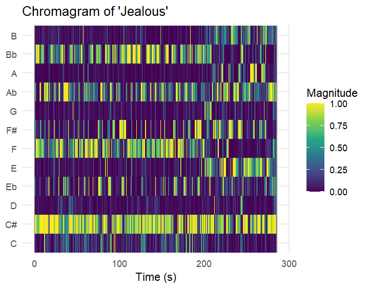
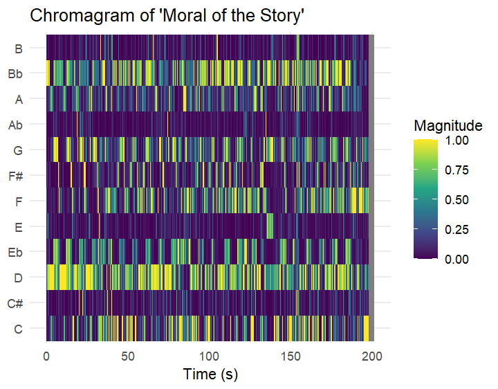
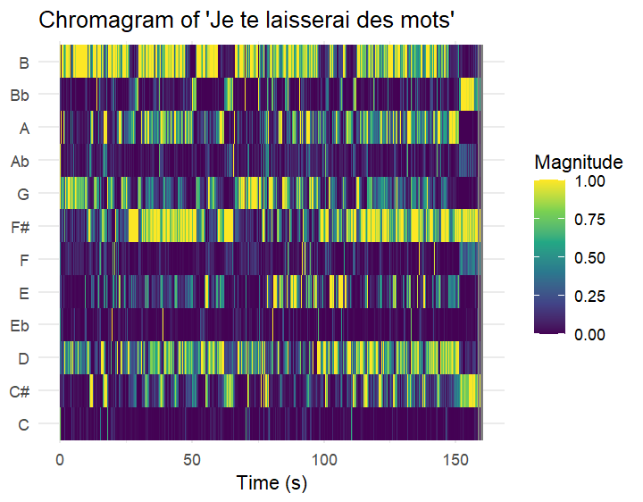
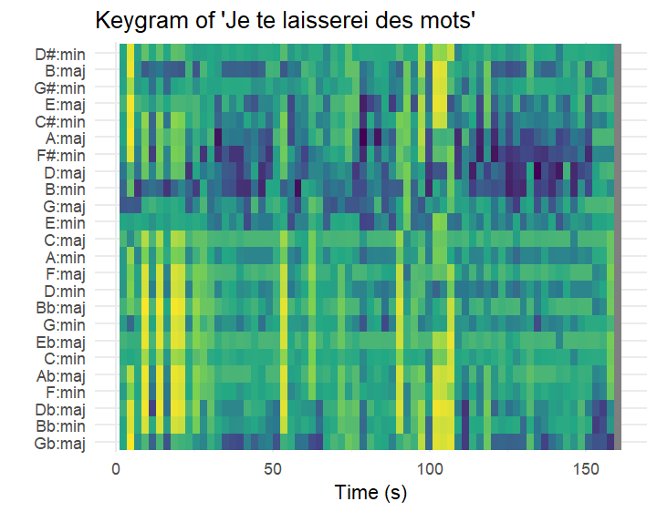
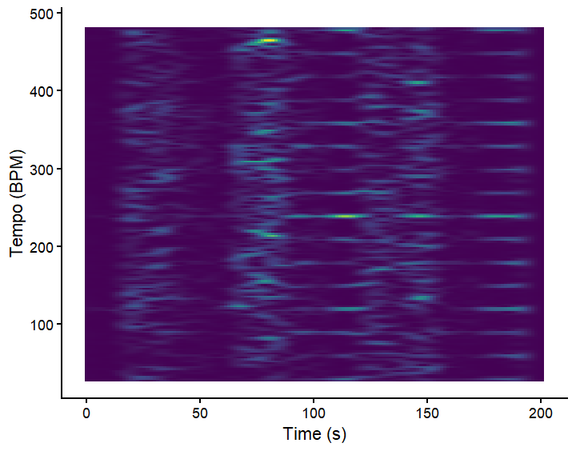
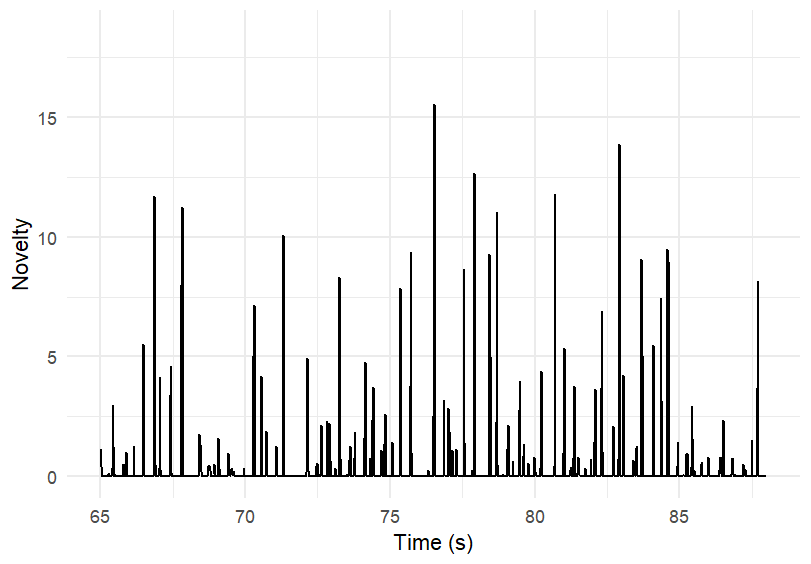
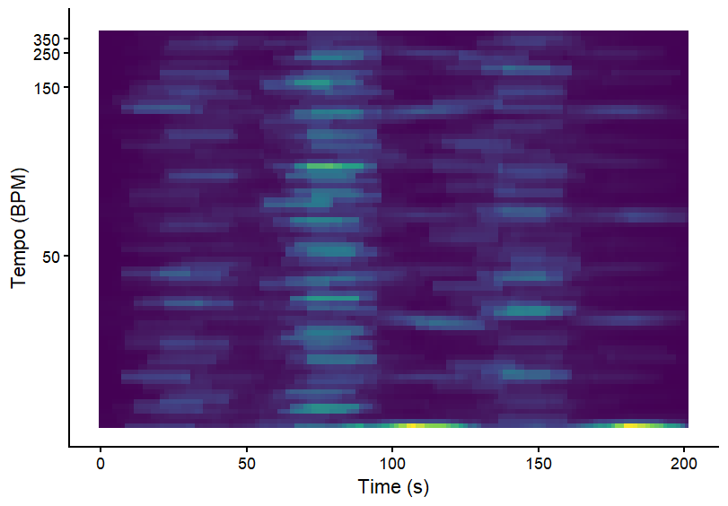

# Computational Musicology- Corpus

I am investigating the differences in my Spotify wrapped before, during and after the Covid lockdown. The following graphs are of my top songs in 2019 (before), 2020 (during), 2021(after), which are Jealous-Labrynth, Moral of the Story-Ashe, and Je te laisserai des mots-Patrick Watson respectively

# Chromagrams

### Row

Jealous is a stripped down simple song with only one voice and a piano. The major piano chords in jealous are Db (C#), Gb (F#), Ab and Bb. All these can be easily seen in the chromagram.

### Row

Moral of the story is full with many harmonies and multiple instruments, and seemingly heavy production. As is to be expected, we can see more notes highlighted as was expected due to there being many harmonies and instruments.

### Row

Similar to Jealous, this song is more simple, it has piano, one voice and a string section which occasionally is played. We can see the key chords throught the entire song very clearly.

# Keygram

### Row

### Row

As can be seen in the keygram, the tonal centre is G major which can be seen as the most dark blue part in the image. Other keys such as D major and Bm are also quite dark in colour as they are close to G major in the circle of fifths.

Since this song is a relatively simple song, it makes sense that the tonal centre seems to stay around the same keys and no key change can be seen.

Except for one area around 100 seconds where there is a slight gap in the dark blue, which is also around the time the string section is introduced into the song, so that could explain a slight break in the keygram.

# Tempogram

### Row

This is the fourier tempogram for 'Moral of the Story' by Ashe. It is not a very clear picture. In the areas where this is almost a criss-cross pattern, in those parts of the song, she is almost speaking-singing. I believe the software is unable to pick up the tempo due to that reason. However, in the more instrumental and actual singing parts, we can see clear lines of the tempo (and even the different tempo harmonics).

### Row

This is the novelty function of 'Moral of the Story' by Ashe. In between seconds 65 and 90, there was a lot of activity in the novelty function. If you see the fourier tempogram, this is around the second block of the criss-cross pattern. This is when she is almost speaking, which is why the software isn't able to pick up the tempo.

### Row

The autocorrelation tempogram is not very clear. This is because the autocorrelation tempogram reads the rhythmic self-similarity. Throughout the song there is a lot of different instruments, harmonies and different styles of singing as well. I believe due to this diversity, this tempgram is unclear. 
